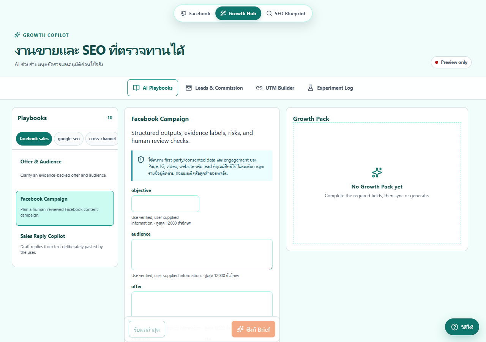
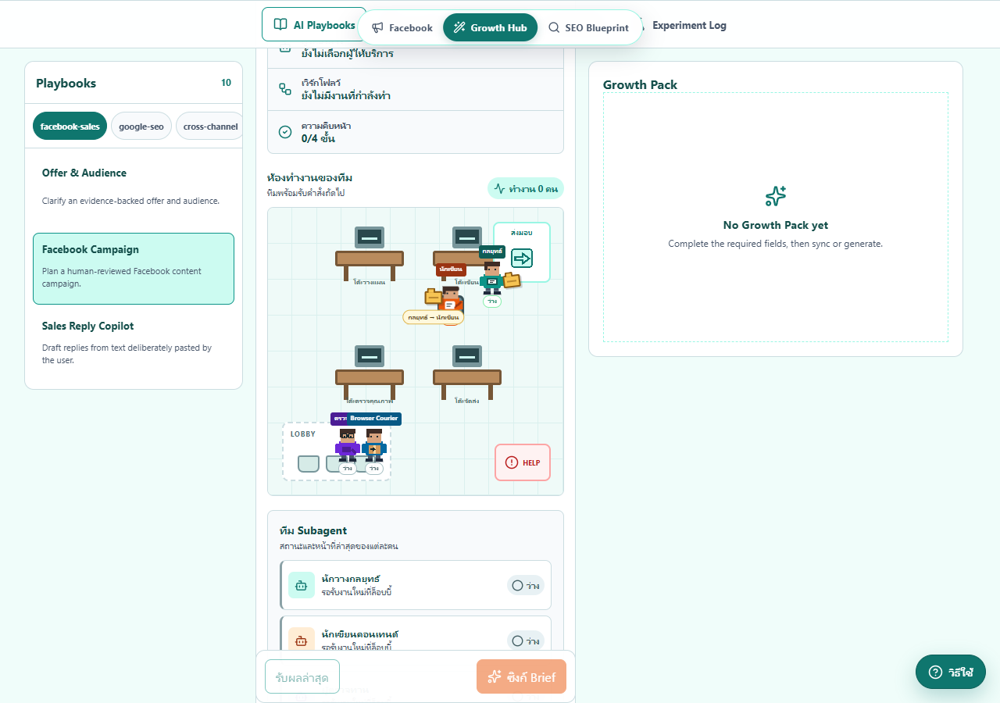
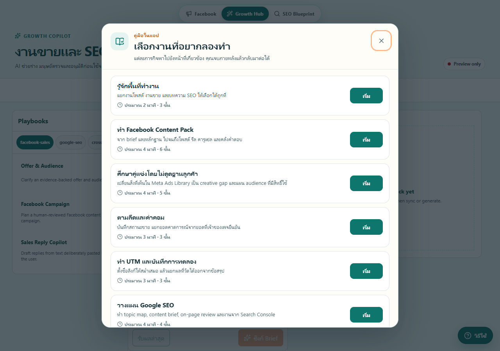
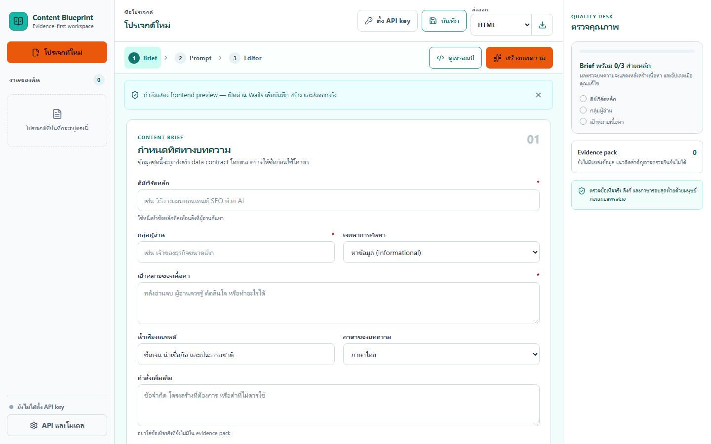
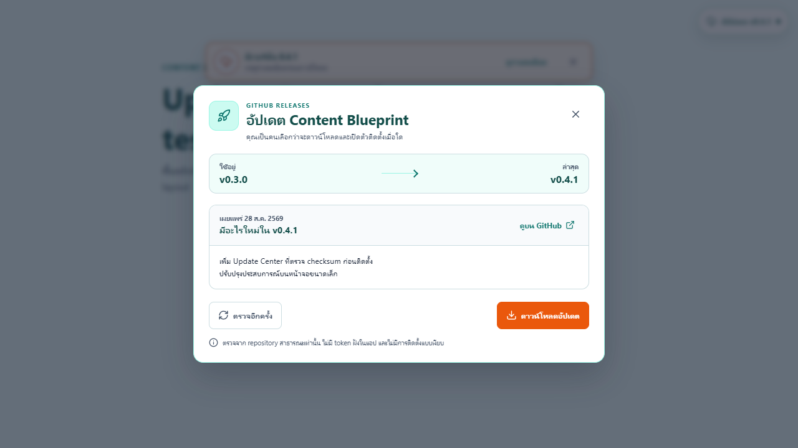

# Content Blueprint

เครื่องมือ Windows สำหรับแอดมินเพจและทีมการตลาดที่ต้องเปลี่ยน Brief เป็นงาน Facebook, งานขาย และ SEO โดยยังตรวจทุกชิ้นก่อนนำไปใช้

[](https://github.com/Useless007/content-blueprint/releases/latest)
[](https://github.com/Useless007/content-blueprint/actions/workflows/ci.yml)
[](LICENSE)
[](#ติดตั้งบน-windows)

Content Blueprint เป็นแอป Go + Wails ที่เก็บ Brief และชิ้นงานไว้ในเครื่อง เรียก Claude Code หรือ Codex CLI ที่คุณล็อกอินไว้แล้ว และส่งผลผ่านสัญญาข้อมูลที่ Go ตรวจซ้ำ แอปไม่ล็อกอิน Facebook, ไม่ scrape โปรไฟล์หรือฐานลูกค้า, ไม่ส่งข้อความ และไม่กดเผยแพร่แทนผู้ใช้

[ดาวน์โหลดตัวติดตั้ง Windows](https://github.com/Useless007/content-blueprint/releases/latest/download/content-blueprint-amd64-installer.exe) · [ดาวน์โหลด SHA256SUMS](https://github.com/Useless007/content-blueprint/releases/latest/download/SHA256SUMS.txt) · [ดู Release notes](https://github.com/Useless007/content-blueprint/releases/latest) · [เริ่มใช้ใน 5 นาที](docs/quick-start.md)

[ขอบเขตข้อมูลส่วนตัว](docs/privacy.md) · [สถาปัตยกรรม](docs/architecture.md)

## ติดตั้งบน Windows

ต้องใช้ Windows 10/11 แบบ 64-bit และ Microsoft WebView2 ตัวติดตั้งเป็นแบบ per-user จึงไม่ขอสิทธิ์ Administrator

1. เปิด [GitHub Releases](https://github.com/Useless007/content-blueprint/releases/latest) แล้วดาวน์โหลด `content-blueprint-amd64-installer.exe` กับ `SHA256SUMS.txt`
2. ตรวจ SHA-256 ก่อนเปิดไฟล์:

   ```powershell
   Get-FileHash .\content-blueprint-amd64-installer.exe -Algorithm SHA256
   Get-Content .\SHA256SUMS.txt
   ```

   ค่า hash ของ installer ต้องตรงกับบรรทัดชื่อเดียวกันใน `SHA256SUMS.txt`
3. เปิด installer แล้วเปิด Content Blueprint จาก Start Menu หรือ Desktop
4. กด **วิธีใช้** ในแอป เลือกหนึ่งใน 8 ภารกิจ แล้วทำตาม Joyride ทีละขั้น

รุ่น `v0.3.0` ยังไม่ได้เซ็นด้วย Windows Authenticode จึงอาจเจอ Microsoft Defender SmartScreen ให้ดำเนินการต่อเฉพาะเมื่อดาวน์โหลดจาก repository นี้และ SHA-256 ตรงกัน ดูรายละเอียดใน [คู่มือเริ่มต้น](docs/quick-start.md#ถ้า-smartscreen-เตือน)

## ทำอะไรได้บ้าง

| ส่วน | งานที่รองรับ | ขอบเขตที่คงไว้ |
| --- | --- | --- |
| Facebook Content Pack | โพสต์ยาว/สั้น, hooks, Reel script, carousel, CTA, first comment, reply bank และ compliance notes | ผู้ใช้ตรวจและกดเผยแพร่เอง |
| Growth Hub | Playbook 10 แบบ, Leads & Commission, UTM Builder และ Experiment Log | ตัวเลขยอดขาย/ค่าคอมมาจากข้อมูลที่ผู้ใช้กรอกหรือ import โดยมีที่มา |
| SEO Workspace | Content Brief, ร่างบทความ, quality checks และ export | URL อย่างเดียวไม่ถือว่า AI เปิดอ่านหรือเป็นหลักฐานแล้ว |
| Claude/Codex | Quick draft หนึ่ง worker หรือ AI Team แบบ Strategist → Producer → Reviewer | เรียก CLI แบบจำกัดสิทธิ์และตรวจ structured output หลังรับผล |
| AI Studio | ตัวละครเดินไปโต๊ะ นั่งทำงาน และส่งแฟ้มตาม event ของงานจริง | เป็นภาพสถานะ ไม่ได้เพิ่มสิทธิ์ให้ agent |
| Chrome/Brave | Side panel รับ Content/Growth Pack และแทรก plain text ลง editor ที่ผู้ใช้โฟกัส | ไม่ค้นหาหรือคลิก Post, Schedule หรือ Send |
| MCP | 7 tools สำหรับอ่าน Brief และบันทึก Pack แบบ revision-bound | ไม่มี tool เปิด browser, scrape, โพสต์, ส่งข้อความ หรืออัปโหลด audience |
| Updater | ตรวจรุ่นใหม่อัตโนมัติไม่เกินวันละครั้ง หรือกดตรวจเอง | ดาวน์โหลดและเปิด installer เมื่อผู้ใช้ยืนยันแต่ละขั้น พร้อมตรวจ SHA-256 |

## หน้าจอจริง

<table>
  <tr>
    <td width="50%"><br/><sub>Growth Hub: Playbook, Brief และผลที่รอตรวจ</sub></td>
    <td width="50%"><br/><sub>AI Studio: ตัวละครขยับตาม stage event และส่งงานต่อกัน</sub></td>
  </tr>
  <tr>
    <td width="50%"><br/><sub>Guided missions: Joyride ภาษาไทย 8 เส้นทาง</sub></td>
    <td width="50%"><br/><sub>SEO Workspace: Brief, draft, checks และ export</sub></td>
  </tr>
  <tr>
    <td colspan="2"><br/><sub>Update Center: ตรวจรุ่น ดาวน์โหลด ตรวจ SHA-256 และยืนยันก่อนเปิด installer</sub></td>
  </tr>
</table>

## ใช้ Claude Code หรือ Codex โดยไม่ใส่ API key ในแอป

ติดตั้งและล็อกอิน Claude Code CLI หรือ Codex CLI ด้วยบัญชีของคุณก่อนเปิด Content Blueprint จากนั้นเลือก provider ใน Facebook Workspace หรือ Growth Hub แอปเรียก executable โดยตรง ไม่อ่าน API key ของ provider จากหน้า UI และไม่เก็บ key แยกสำหรับเส้นทางนี้

```powershell
claude --version
codex --version
```

การไม่ใส่ API key ใน Content Blueprint ไม่ได้แปลว่า provider ใช้งานฟรี ทุกคำขอยังอยู่ภายใต้แผนสมาชิก โควตา rate limit นโยบายข้อมูล และข้อกำหนดของบัญชี Claude/Codex ที่ล็อกอินอยู่ AI Team ใช้หลาย model calls มากกว่า Quick draft

ลำดับใช้งานสั้น ๆ:

1. เลือก Facebook หรือ Growth Hub
2. กรอก Brief และ Evidence Notes ที่ตรวจแล้ว
3. เลือก Quick draft หรือ AI Team
4. ดูสถานะใน AI Studio
5. ตรวจ Pack และกดยืนยันก่อนคัดลอก ส่งต่อ หรือแทรกใน browser

## Chrome/Brave extension

Installer ลงทะเบียน Native Messaging host ให้ Chrome และ Brave ไว้แล้ว แต่ browser ไม่อนุญาตให้แอปทั่วไปติดตั้ง unpacked extension แบบเงียบ คุณจึงต้องเปิด Developer mode หนึ่งครั้ง:

1. เปิด `chrome://extensions` หรือ `brave://extensions`
2. เปิด **Developer mode** แล้วกด **Load unpacked**
3. เลือก `%LOCALAPPDATA%\Programs\Content Blueprint\facebook-extension`
4. ตรวจว่า extension ID คือ `ppncejmpiekmkepaeccdnpnpgdcfafje`
5. เปิด side panel ของ Content Blueprint แล้วทดสอบ **เชื่อมต่อโปรแกรมในเครื่อง**

Extension แทรกเฉพาะ plain text ลง element ที่ผู้ใช้โฟกัสด้วยการกระทำจริง ผู้ใช้ยังต้องตรวจข้อความและกดเผยแพร่เอง ดูขั้นตอนจาก source และวิธีแก้ปัญหาใน [facebook-extension/README.md](facebook-extension/README.md)

## ใช้ MCP จาก Claude Code หรือ Codex

MCP เหมาะเมื่อคุณอยากเปิด CLI เอง ให้ agent อ่าน Brief ล่าสุดจาก Content Blueprint แล้วบันทึก Pack ที่ผ่าน schema กลับมา Companion ที่ installer ลงไว้ใช้ได้กับทั้งสอง CLI:

```powershell
$companion = "$env:LOCALAPPDATA\Programs\Content Blueprint\native-host\content-blueprint-companion.exe"

codex mcp add content-blueprint-facebook -- $companion
claude mcp add --transport stdio --scope user content-blueprint-facebook -- $companion
```

ตรวจการเชื่อมต่อใน CLI แล้วสั่งให้ใช้ server `content-blueprint-facebook` เครื่องมือนี้มี Facebook 3 tools และ Growth 4 tools ชื่อและ contract ทั้งหมดอยู่ใน [คู่มือเริ่มต้น](docs/quick-start.md#ใช้-mcp-แทนการให้-wails-เปิด-cli)

## การอัปเดต

แอปตรวจ GitHub Releases อัตโนมัติไม่เกินหนึ่งครั้งต่อ 24 ชั่วโมง และมีปุ่มตรวจเอง การพบรุ่นใหม่ไม่ทำให้ดาวน์โหลดหรือติดตั้งเอง:

1. ผู้ใช้กดดาวน์โหลด
2. backend รับเฉพาะ asset ชื่อคงที่จาก `Useless007/content-blueprint` และตรวจ SHA-256 จาก `SHA256SUMS.txt`
3. ผู้ใช้กดยืนยันอีกครั้งเพื่อเปิด installer ที่ตรวจแล้ว

แอปไม่ส่ง token ไป GitHub และไม่ติดตั้งแบบ silent รุ่นปัจจุบันยัง unsigned จึงอาจเจอ SmartScreen ในทุกครั้งที่อัปเกรด

## พัฒนาจาก source

ต้องมี Go 1.26.7+, Node.js 22.12+, Wails CLI v2.15 และ Git

```powershell
git clone https://github.com/Useless007/content-blueprint.git
cd content-blueprint

go install github.com/wailsapp/wails/v2/cmd/wails@v2.15.0
cd frontend
npm ci
cd ..
wails doctor
wails dev
```

รันชุดตรวจหลัก:

```powershell
cd frontend
npm ci
npm run build

cd ..
go test ./...
go vet ./...
go run golang.org/x/vuln/cmd/govulncheck@v1.7.0 ./...

cd facebook-extension
npm ci
npm test
```

ต้อง build `frontend/dist` ก่อน `go test` เพราะ Wails ฝังไฟล์ frontend ไว้ใน Go executable

Real-browser smoke ต้องใช้ Chrome และ Brave ที่ติดตั้งจริง รวมทั้ง Native Messaging host ดูคำสั่งและ fixture ที่ไม่แตะบัญชี Facebook จริงใน [คู่มือ E2E](facebook-extension/tests/e2e/README.md)

สร้าง Windows installer ด้วย NSIS:

```powershell
choco install nsis -y
.\build\windows\build-release.ps1
```

ผลลัพธ์อยู่ใน `build\bin` พร้อม `SHA256SUMS.txt` งาน release จาก tag `v*.*.*` ใช้ workflow เดียวกันและเผยแพร่หลัง test ผ่าน

## โครงสร้าง

```text
Brief + Evidence Notes
        │
        ▼
Go/Wails contracts ── direct CLI ──► Claude Code / Codex
        │                                  │
        │◄──── validated Content/Growth Pack
        │
        ├── local JSON stores
        ├── MCP companion ◄── Claude/Codex ที่ผู้ใช้เปิดเอง
        └── Native Messaging ──► Chrome/Brave side panel ──► focused editor
```

ผลทุกชุดผูกกับ `BriefRevision` ถ้า Brief เปลี่ยน ผลเก่าจะเป็น stale และไม่ถูกนำมาใช้เงียบ ๆ อ่าน trust boundaries และ data flow เพิ่มเติมใน [docs/architecture.md](docs/architecture.md)

## ขอบเขต Facebook และข้อมูลลูกค้า

Content Blueprint รองรับการวิเคราะห์คู่แข่งจากข้อมูลสรุปที่ผู้ใช้ป้อนเอง, Ads Library aggregate, Page Insights ของเพจที่ได้รับสิทธิ์ และ first-party audience sources ที่เจ้าของเพจมีสิทธิ์ใช้ ระบบไม่เก็บ followers, reactions, comments, profiles, inbox หรือฐานลูกค้ารายบุคคลจากเพจอื่น

โปรไฟล์ที่เปิดเป็น public ไม่ใช่คำยินยอมให้นำข้อมูลบุคคลไปเก็บเป็นฐานลูกค้าหรืออัปโหลดเป็น audience ผู้ใช้ต้องตรวจสิทธิ์ ฐานกฎหมาย นโยบายแพลตฟอร์ม และทาง opt-out ของข้อมูลทุกชุด รายละเอียดอยู่ใน [docs/privacy.md](docs/privacy.md)

## Roadmap

- เซ็น executable และ installer ด้วย Windows Authenticode
- เพิ่ม signed update manifest หรือ build provenance ที่ตรวจแยกจาก checksum ใน release เดียวกัน
- ทดสอบ fresh install และ upgrade บน clean Windows VM หลายรุ่น
- เตรียมช่องทางติดตั้ง extension ที่ไม่ต้องเปิด Developer mode
- เพิ่ม import จาก first-party exports โดยมี consent/provenance ต่อชุดข้อมูล

ดูสถานะจริงและข้อจำกัดของรุ่นนี้ใน [release notes v0.3.0](docs/release-notes/v0.3.0.md)

## ร่วมพัฒนาและรายงานปัญหา

อ่าน [CONTRIBUTING.md](CONTRIBUTING.md) ก่อนเปิด pull request ใช้ issue form สำหรับ [bug](https://github.com/Useless007/content-blueprint/issues/new?template=bug_report.yml) หรือ [feature request](https://github.com/Useless007/content-blueprint/issues/new?template=feature_request.yml) ปัญหาความปลอดภัยให้ทำตาม [SECURITY.md](SECURITY.md) และอย่าใส่ token, cookie, customer data หรือ Brief จริงใน issue

โครงการนี้ใช้ [MIT License](LICENSE)
