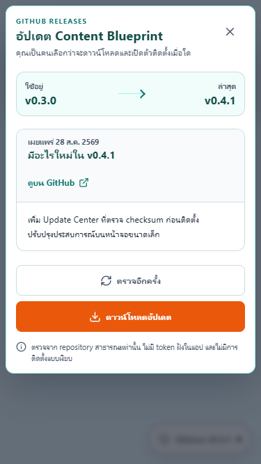

# เริ่มใช้ Content Blueprint

คู่มือนี้พาไปจากไฟล์ติดตั้งจนได้ Pack แรก โดยไม่ต้อง clone source

## 1. ดาวน์โหลดและตรวจไฟล์

ดาวน์โหลดสองไฟล์จาก [release ล่าสุด](https://github.com/Useless007/content-blueprint/releases/latest):

- `content-blueprint-amd64-installer.exe`
- `SHA256SUMS.txt`

เปิด PowerShell ในโฟลเดอร์ Downloads แล้วรัน:

```powershell
Get-FileHash .\content-blueprint-amd64-installer.exe -Algorithm SHA256
Get-Content .\SHA256SUMS.txt
```

เทียบตัวอักษร hash ทั้ง 64 ตัวกับบรรทัดของ installer ถ้าไม่ตรง อย่าเปิดไฟล์ ให้ลบไฟล์ที่ดาวน์โหลดและรายงานผ่าน [SECURITY.md](../SECURITY.md)

## ถ้า SmartScreen เตือน

รุ่น `v0.3.0` ยังไม่ได้เซ็น Windows Authenticode จึงอาจเห็นหน้าต่าง **Windows protected your PC** ตรวจว่าดาวน์โหลดจาก `github.com/Useless007/content-blueprint` และ SHA-256 ตรงก่อนเลือก **More info** > **Run anyway** หากที่มาหรือ hash ไม่ตรง ให้ยกเลิก

Installer ลงโปรแกรมไว้ที่:

```text
%LOCALAPPDATA%\Programs\Content Blueprint
```

ข้อมูล Brief/Pack ไม่ถูกลบตอนถอนโปรแกรม ดูตำแหน่งข้อมูลใน [privacy.md](privacy.md#ข้อมูลที่เก็บในเครื่อง)

## 2. เตรียม AI provider

เลือกอย่างน้อยหนึ่งทาง:

- Claude Code CLI ที่ติดตั้งและล็อกอินแล้ว
- Codex CLI ที่ติดตั้งและล็อกอินแล้ว
- Gemini API key สำหรับ SEO Workspace หรือโหมดสร้างตรงจาก extension

ตรวจว่า CLI อยู่ใน `PATH`:

```powershell
claude --version
codex --version
```

Content Blueprint ไม่ต้องรับ API key เพิ่มสำหรับเส้นทาง Claude/Codex แต่การเรียกโมเดลยังใช้แผนสมาชิก โควตา และเงื่อนไขของบัญชีที่ล็อกอิน

## 3. ทำ Pack แรก

1. เปิด Content Blueprint
2. กด **วิธีใช้** แล้วเลือก **ทำ Facebook Content Pack** หรือ **รู้จักพื้นที่ทำงาน**
3. เลือก provider ที่แอปรายงานว่าพร้อม
4. กรอกหัวข้อ กลุ่มเป้าหมาย เป้าหมาย น้ำเสียง รายละเอียดสินค้า และ Evidence Notes ที่ตรวจแล้ว
5. เลือก **Quick draft** สำหรับ worker เดียว หรือ **AI Team** สำหรับ Strategist → Copywriter → Reviewer
6. ดู stage ใน AI Studio ตัวละครขยับจาก event ที่ backend ส่ง ไม่ใช่ progress timer จำลอง
7. ตรวจ hooks, โพสต์, Reel, carousel, CTA, first comment, reply bank และ compliance notes
8. ถ้าแก้ Brief หลังสร้าง ให้สร้างใหม่เมื่อ Pack เดิมแสดงสถานะ stale

AI Team ใช้ model calls มากกว่า Quick draft และอาจใช้ repair call เมื่อผลไม่ผ่าน validator

## 4. เปิด Chrome/Brave side panel

1. เปิด `chrome://extensions` หรือ `brave://extensions`
2. เปิด **Developer mode**
3. กด **Load unpacked** แล้วเลือก:

   ```text
   %LOCALAPPDATA%\Programs\Content Blueprint\facebook-extension
   ```

4. ตรวจ extension ID `ppncejmpiekmkepaeccdnpnpgdcfafje`
5. เปิด extension side panel แล้วกดตรวจ Native Companion
6. เลือก editor ใน Facebook ด้วยการคลิกเอง จากนั้นใช้ปุ่มแทรกข้อความที่ต้องการ
7. อ่าน ตรวจ แก้ และกดเผยแพร่เอง

Extension ไม่ค้นหา editor เองถ้าผู้ใช้ยังไม่โฟกัส และไม่มีคำสั่งกด Post, Schedule หรือ Send

## ใช้ MCP แทนการให้ Wails เปิด CLI

Installer มี companion executable อยู่แล้ว ลงทะเบียนกับ CLI จาก PowerShell:

```powershell
$companion = "$env:LOCALAPPDATA\Programs\Content Blueprint\native-host\content-blueprint-companion.exe"

codex mcp add content-blueprint-facebook -- $companion
claude mcp add --transport stdio --scope user content-blueprint-facebook -- $companion
```

MCP server มี tools ต่อไปนี้:

| Facebook | Growth |
| --- | --- |
| `get_facebook_brief` | `list_growth_playbooks` |
| `save_facebook_pack` | `get_growth_brief` |
| `get_latest_facebook_pack` | `save_growth_pack` |
|  | `get_latest_growth_pack` |

เมื่อต้องการเลิกใช้ MCP ให้ลบรายการออกจากแต่ละ CLI ด้วยคำสั่ง:

```powershell
codex mcp remove content-blueprint-facebook
claude mcp remove --scope user content-blueprint-facebook
```

ตัวอย่างคำสั่งให้ agent:

```text
ใช้ MCP server content-blueprint-facebook เรียก get_facebook_brief
ทำ Facebook Content Pack ให้ครบ contract โดยใช้เฉพาะ Brief และ Evidence Notes ที่ได้
จากนั้นเรียก save_facebook_pack ด้วย briefRevision เดิม
ห้ามเปิด browser, scrape, ส่งข้อความ หรือเผยแพร่
```

ถ้า Brief เปลี่ยนก่อนบันทึก MCP จะปฏิเสธ revision เก่า

## 5. ตรวจอัปเดต

แอปตรวจ release ใหม่อัตโนมัติไม่เกินวันละครั้ง หรือกด **ตรวจอัปเดต** เองได้ การตรวจไม่ดาวน์โหลดไฟล์

เมื่อมีรุ่นใหม่:

1. อ่านหมายเลขรุ่นและเปิดหน้า GitHub Release หากต้องการตรวจรายละเอียด
2. กดดาวน์โหลด ตัวแอปจะรับ installer ชื่อคงที่และตรวจ SHA-256
3. หลังสถานะแจ้งว่าตรวจ hash แล้ว กดยืนยันอีกครั้งเพื่อเปิด installer

การยกเลิกหรือ network error ไม่ทำให้แอปเดิมหยุดทำงาน Updater ไม่ใช้ silent-install flag



## แก้ปัญหาสั้น ๆ

| อาการ | ตรวจตรงไหน |
| --- | --- |
| แอปไม่พบ Claude/Codex | เปิด PowerShell ใหม่ รัน `claude --version` หรือ `codex --version` แล้วล็อกอิน provider |
| Extension ต่อ companion ไม่ได้ | Reload extension, ตรวจ ID และติดตั้งแอปใหม่เพื่อเขียน Native Messaging registration |
| Pack เป็น stale | กลับไป Brief ปัจจุบันแล้วสร้างหรือบันทึก Pack ด้วย revision ใหม่ |
| แทรกข้อความไม่ได้ | คลิก editor ด้วยตัวเองก่อน แล้วลองแทรกอีกครั้ง |
| Update download ถูกปฏิเสธ | เปิด release page ตรวจ asset `content-blueprint-amd64-installer.exe` และ `SHA256SUMS.txt` |

หากยังแก้ไม่ได้ ให้เปิด [bug report](https://github.com/Useless007/content-blueprint/issues/new?template=bug_report.yml) โดยลบ Brief, customer data, token, path ส่วนตัว และข้อมูลบัญชีออกจากภาพหรือ log ก่อนแนบ
